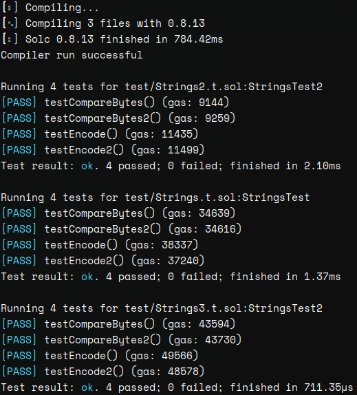

# Which function will win?

Here you can find the `forge test` results:



If we consider the last test as more significant, seeing that it makes more comparisons, `compareBytes` function wins:
```
function compareBytes(string memory a, string memory b) internal pure returns (bool) {
    return keccak256(bytes(a)) == keccak256(bytes(b));
}
```
The function `compareEncode` is the worst:
```
function compareEncode(string memory a, string memory b) internal pure returns (bool) {
    return keccak256(abi.encode(a)) == keccak256(abi.encode(b));
}
```
Version `2` of each function adds the length comparison, but the results show it's useless.